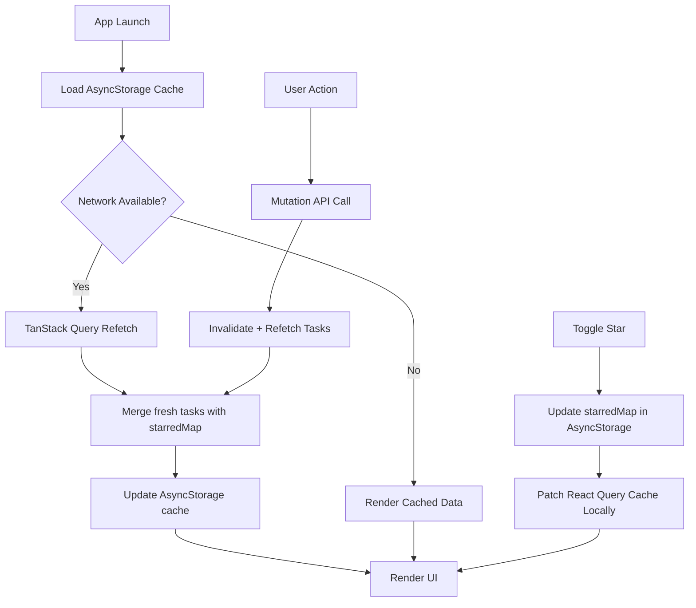

# Task Management

<p align="center">
  
  
  
  
  
  
  
</p>

A production-grade, offline-first **React Native Task Manager** with a **Node.js/Express REST API**. The app supports full CRUD operations for tasks and categories, client-side filtering, sorting, debounced search, and local cache persistence — with a local-only `starred` field that survives server refreshes.

---

## Table of Contents

- [Project Overview](#1-project-overview)
- [Repository Structure](#2-repository-structure)
- [Tech Stack](#3-tech-stack)
- [Features](#4-features)
- [Architecture](#5-architecture)
- [Backend](#6-backend)
- [Local Storage](#7-local-storage)
- [State Management](#8-state-management)
- [Cache Merge Strategy](#9-cache-merge-strategy)
- [Offline Strategy](#10-offline-strategy)
- [Filter & Sort](#11-filter--sort)
- [Testing](#12-testing)
- [Environment Variables](#13-environment-variables)
- [Setup](#14-setup)
- [AI Usage](#15-ai-usage)
- [Known Limitations](#16-known-limitations)
- [Future Improvements](#17-future-improvements)
- [Assignment Mapping](#18-assignment-mapping)
- [Project Tree](#19-project-tree)
- [Screenshots](#20-screenshots)
- [License](#21-license)

---

## 1. Project Overview

The **Task Management** repository is a full-stack mobile application designed for managing personal tasks and categories. It is split into two independent packages:

- **task-api** — REST API built with Express and Sequelize ORM.
- **task-app** — React Native mobile client built with Expo and TypeScript.

Key capabilities:
- **CRUD Tasks** — Create, read, update, delete, and toggle status (`open` / `done`) for tasks.
- **Categories** — Full CRUD for task categories; tasks can be assigned to a category.
- **Offline-first** — The app reads from a local AsyncStorage cache on launch and surfaces data immediately.
- **Local Cache** — Task and category lists are persisted in AsyncStorage and seeded into React Query.
- **Background Sync** — TanStack Query automatically refetches stale data on reconnect and window focus.
- **Local Starred Field** — A `starred` flag is stored client-side only, persisted across server refreshes.

---

## 2. Repository Structure

```
task-management/
├── task-api/
│   ├── src/
│   │   ├── app.js
│   │   ├── config/
│   │   ├── controllers/
│   │   ├── index.js
│   │   ├── middleware/
│   │   ├── migrations/
│   │   ├── models/
│   │   ├── routes/
│   │   ├── scripts/
│   │   ├── seeders/
│   │   ├── services/
│   │   └── utils/
│   ├── Dockerfile
│   ├── docker-compose.yaml
│   ├── package.json
│   └── ...
└── task-app/
    ├── src/
    │   ├── api/
    │   ├── components/
    │   ├── constants/
    │   ├── hooks/
    │   ├── navigation/
    │   ├── screens/
    │   ├── types/
    │   └── utils/
    ├── App.tsx
    ├── package.json
    ├── tsconfig.json
    └── ...
```

### `task-api`

The **backend** is an Express.js REST API. It provides endpoints for tasks and categories, backed by a relational database via Sequelize ORM. It includes database migrations, seeders, Docker support, and a standard MVC structure (controllers → services → models).

### `task-app`

The **frontend** is a React Native mobile app. It communicates with `task-api` via Axios, caches responses in AsyncStorage, and manages UI state through TanStack Query and React hooks.

---

## 3. Tech Stack

### Frontend (`task-app`)

| Layer | Technology |
|-------|-----------|
| Framework | React Native `0.86.0` + Expo `~57.0.8` |
| Language | TypeScript `~6.0.3` |
| UI / Styling | NativeWind `v4` + Tailwind CSS `3` |
| Navigation | React Navigation Native Stack `v6` |
| State / Cache | TanStack Query `v5` (`@tanstack/react-query`) |
| Networking | Axios `^1.6.7` |
| Offline Storage | `@react-native-async-storage/async-storage` |
| Connectivity | `@react-native-community/netinfo` |
| Icons | `@expo/vector-icons` |

### Backend (`task-api`)

| Layer | Technology |
|-------|-----------|
| Runtime | Node.js `22.x` |
| Framework | Express.js `4.21.0` |
| ORM | Sequelize `6.37.3` + `sequelize-cli` |
| Database | MySQL (`mysql2`) or PostgreSQL (`pg` / `pg-hstore`) |
| Validation | `express-validator` |
| Process Manager | PM2 (prod) / Nodemon (dev) |
| Containerization | Docker + Docker Compose |

---

## 4. Features

✅ **CRUD Tasks** — Create, read, update, delete, and reopen/complete tasks.
✅ **Categories** — Create, read, update, delete, and assign categories to tasks.
✅ **Debounced Search** — 300ms debounced search across task titles and descriptions.
✅ **Offline Read** — App launches with cached data from AsyncStorage.
✅ **Cache Refresh** — Automatic background refetch on reconnect and window focus.
✅ **Local Starred** — Star/unstar tasks; the flag persists across server refreshes.
✅ **Sorting** — Sort by `dueDate` or `createdAt` (ASC / DESC).
✅ **Filtering** — Filter by status (`open` / `done`), category, and due-date presets (`today`, `thisWeek`, `overdue`, `next7Days`).
✅ **Background Refresh** — TanStack Query stale-while-revalidate with 5-minute stale time.
✅ **Loading State** — ActivityIndicator shown during initial cache seed / network fetch.
✅ **Offline Indicator** — SyncStatusBar displays offline badge and connectivity state.
✅ **Last Refresh Time** — Relative timestamp (e.g., "2 min ago") shown in SyncStatusBar.
✅ **Pull to Refresh** — FlatList refresh control triggers a query refetch.
✅ **Task Detail** — Inline edit task title, description, category, and status.
✅ **Task Creation** — Dedicated form screen with validation.

---

## 5. Architecture

### High-Level Data Flow



### `task-api` Architecture

```
src/
├── routes/         # Express routers (/api/tasks, /api/categories)
├── controllers/    # Request handlers, format responses
├── services/       # Business logic, Sequelize queries
├── models/         # Sequelize model definitions
├── middleware/     # Error handling, rate limiting
└── utils/          # Helpers (response envelopes, file storage)
```

### `task-app` Architecture

```
src/
├── api/            # Axios client + endpoint functions
├── screens/        # Top-level UI screens
├── components/     # Reusable presentational components
├── hooks/          # Custom hooks (data fetching, filtering)
├── utils/          # Pure utility functions (merge, filter, sort)
├── navigation/     # React Navigation setup
├── types/          # TypeScript interfaces
└── constants/      # Theme, colors, spacing
```

Filter and sort logic is deliberately separated from JSX in `src/utils/taskFilters.ts` to keep components declarative and logic testable.

---

## 6. Backend

### Database

The API supports **MySQL** (default) and **PostgreSQL** via Sequelize's dialect abstraction. The database type is selected with the `DB_TYPE` environment variable.

### Schema

#### `categories`

| Column | Type | Constraints |
|--------|------|-------------|
| `id` | UUID | Primary Key, default `UUIDV4` |
| `name` | STRING | `NOT NULL`, `UNIQUE` |
| `created_at` | DATETIME | Timestamp |
| `updated_at` | DATETIME | Timestamp |

#### `tasks`

| Column | Type | Constraints |
|--------|------|-------------|
| `id` | UUID | Primary Key, default `UUIDV4` |
| `title` | STRING | `NOT NULL` |
| `description` | TEXT | Nullable |
| `category_id` | UUID | Nullable, FK → `categories.id` (`ON DELETE SET NULL`) |
| `status` | ENUM | `'open'` or `'done'`, default `'open'` |
| `due_date` | DATE | Nullable |
| `created_at` | DATETIME | Timestamp |
| `updated_at` | DATETIME | Timestamp |

Indexes are created on `tasks.status` and `tasks.category_id` for query performance.

### Relationships

- **Category** `1 ──∞` **Task**
  - A category can have many tasks.
  - Deleting a category sets `category_id` to `NULL` on its tasks.

### API Structure

All routes are mounted under `/api`.

| Method | Path | Description |
|--------|------|-------------|
| `GET` | `/api/tasks` | List tasks with optional filters (`search`, `categoryId`, `status`, `sortBy`, `sortOrder`) |
| `GET` | `/api/tasks/:id` | Get a single task |
| `POST` | `/api/tasks` | Create a task |
| `PUT` | `/api/tasks/:id` | Update a task |
| `PATCH` | `/api/tasks/:id/status` | Toggle task status |
| `DELETE` | `/api/tasks/:id` | Delete a task |
| `GET` | `/api/categories` | List categories with optional `search` filter |
| `GET` | `/api/categories/:id` | Get a single category |
| `POST` | `/api/categories` | Create a category |
| `PUT` | `/api/categories/:id` | Update a category |
| `DELETE` | `/api/categories/:id` | Delete a category |

All responses use a standard envelope: `{ success, message, data }`.

### Environment Variables

See [13. Environment Variables](#13-environment-variables).

### Migration & Seed

```bash
npm run migrate      # Run pending migrations
npm run migrate:undo # Rollback all migrations
npm run seed         # Reset seeds and re-run
```

---

## 7. Local Storage

The app uses **`@react-native-async-storage/async-storage`** for offline-first caching.

### Why AsyncStorage?

- No native module rebuild required (pure JS bridge).
- Sufficient for small datasets typical of a personal task manager.
- Simple key/value interface fits the cache patterns needed here.

### Cache Keys

| Key | Content |
|-----|---------|
| `taskCache` | Raw task list returned by the server (without local flags). |
| `categoryCache` | Raw category list returned by the server. |
| `starredMap` | `Record<taskId, boolean>` — local-only starred state. |
| `lastRefreshedAt` | Unix timestamp (ms) of the last successful sync. |

### How Cache Is Loaded

On app launch, `usePersistedTasksQuery` reads `taskCache` and `starredMap` from AsyncStorage, merges them via `mergeTasksWithStarred`, and passes the result as `initialData` to TanStack Query. This means the UI renders cached data immediately, even before the network request completes.

### How Cache Is Updated

After every successful `fetchTasks` call, the raw server response is written to `taskCache` (via `setCachedTasks`), and `lastRefreshedAt` is updated. The `starredMap` is **not** touched during a refresh — it is only modified by explicit user actions (toggle star).

---

## 8. State Management

### Library: TanStack Query (`@tanstack/react-query` v5)

No Redux, MobX, or global Context reducer is used. The app relies on TanStack Query for all server-state management and derived local state.

### Why TanStack Query?

- **Built-in caching** with configurable `staleTime` and `gcTime`.
- **Background refetching** on reconnect and window focus (`refetchOnReconnect`, `refetchOnWindowFocus`).
- **Cache invalidation** after mutations (create, update, delete, status toggle) via `invalidateQueries` + `refetchQueries`.
- **Local cache patching** for the starred toggle via `setQueryData`.

### Data Flow

```
API Response
    │
    ▼
TanStack Query Cache (["tasks"])
    │
    ├─► UI (TaskListScreen, TaskCard)
    │
    ├─► AsyncStorage (taskCache, lastRefreshedAt)
    │
    └─► Local Patch (starredMap) ──► mergeTasksWithStarred ──► setQueryData
```

- **Server state**: tasks and categories fetched via `useQuery`, cached by TanStack Query.
- **Local-only state**: `starredMap` persisted in AsyncStorage, merged into the query result on read.
- **UI state**: filter/sort/sortOrder are `useState` inside `TaskListScreen` and passed into `useTaskFilters`.

---

## 9. Cache Merge Strategy

The `starred` field is **client-side only** — it does not exist on the backend. The challenge is to preserve starred flags across server refreshes.

### Strategy

1. **Separate storage**: `starredMap` is stored in a dedicated AsyncStorage key, independent of `taskCache`.
2. **Server cache is clean**: When fresh data arrives from the API, it is saved to `taskCache` without any local fields.
3. **Merge on read**: Every time tasks are read (on launch or after refetch), `mergeTasksWithStarred(freshTasks, starredMap)` maps over the array and attaches the `starred` boolean.

### Pseudocode

```typescript
// On every successful fetch
freshTasks = await api.getTasks();
starredMap = await AsyncStorage.getItem("starredMap"); // { "task-1": true, "task-3": true }
tasksWithLocal = freshTasks.map(t => ({ ...t, starred: !!starredMap[t.id] }));
await AsyncStorage.setItem("taskCache", JSON.stringify(freshTasks)); // clean server data

// On star toggle
await AsyncStorage.setItem("starredMap", JSON.stringify({ ...starredMap, [id]: true }));
queryClient.setQueryData(["tasks"], old => mergeTasksWithStarred(old, newStarredMap));
```

This ensures that:
- The server cache always reflects the authoritative server state.
- The local `starred` flag is never lost, even if the task title or status changes on the server.
- No conflict resolution is needed because `starred` is a purely additive local field.

---

## 10. Offline Strategy

### App Launch

1. `usePersistedTasksQuery` mounts.
2. Reads `taskCache` and `starredMap` from AsyncStorage in parallel.
3. Merges them and sets `initialData` on the TanStack Query.
4. Renders the list immediately with cached data.

### Background Refresh

- TanStack Query is configured with `staleTime: 5 minutes` and `refetchOnReconnect: true`, `refetchOnWindowFocus: true`.
- When connectivity is restored (`NetInfo` listener), the query automatically refetches.

### Offline Fallback

- If the network is unreachable, `fetchTasks` rejects.
- The UI falls back to the cached `initialData` (or the last successful query result).
- `SyncStatusBar` shows an offline badge.
- The pull-to-refresh control shows a spinner; if it fails, cached data remains visible.

### Error Handling

- Axios response interceptor logs the error URL, status, and data.
- Network errors (no response) trigger a console warning with troubleshooting guidance.
- Mutations invalidate the query cache; if the API call fails, the cache is not invalidated, preserving the previous UI state.

---

## 11. Filter & Sort

### Where the Logic Lives

Filter and sort logic is implemented in **`src/utils/taskFilters.ts`** — a pure function module completely decoupled from React Native components and JSX.

```typescript
export function filterAndSortTasks(tasks: TaskWithLocal[], filters: TaskFilters): TaskWithLocal[]
```

This function:
- Chains `Array.filter` calls for search, category, status, and due-date presets.
- Applies `Array.sort` for `dueDate` and `createdAt`.
- Returns a new array; it never mutates the input.

### Why Outside JSX?

- **Testability**: Pure functions are trivially unit-testable with Jest.
- **Reusability**: The same logic can be consumed by hooks, screens, or future web/desktop adapters.
- **Performance**: Filtering runs only when dependencies change (via `useTaskFilters`), not on every render.

### Debounced Search

`SearchBar` uses the `useDebouncedValue` hook (300ms delay) to avoid firing filters on every keystroke. The debounced value is passed into `useTaskFilters`, which calls `filterAndSortTasks` with the stabilized input.

---

## 12. Testing

### Test Files

| Test File | Purpose | What Is Validated |
|-----------|---------|-------------------|
| `src/utils/__tests__/taskFilters.test.ts` | Validate filter/sort utility | Category filter, status filter, search (title + description), sort by `dueDate` ASC/DESC, sort by `createdAt` ASC/DESC, due-date presets (`today`, `overdue`, `next7Days`). |
| `src/utils/__tests__/mergeTasks.test.ts` | Validate starred merge | Starred tasks are marked correctly; starred flag survives title updates; missing IDs default to `false`; empty arrays return `[]`. |
| `src/components/__tests__/TaskCard.test.tsx` | Validate component rendering | Task title and status text (`OPEN` / `DONE`) appear in the serialized component tree for both open and done tasks. |

### Why These Tests?

- **`taskFilters`** is the core business logic for the list view. It must be deterministic and correct across all filter combinations.
- **`mergeTasksWithStarred`** is the critical offline-stability mechanism. A regression here would silently lose user starred state.
- **`TaskCard`** is the primary presentational unit; verifying its render output catches regressions in prop typing and conditional styling.

### Running Tests

```bash
npm test        # Watch mode (default script)
npx jest --no-watch  # Single run
```

---

## 13. Environment Variables

### `task-api` (`.env`)

```env
NODE_ENV=development

ALLOWED_ORIGINS=http://localhost:8081,exp://10.20.131.169:8081

PORT=3001

BASE_URL=http://localhost:3001

JWT_EXPIRES_IN=7d
JWT_SECRET=XXXX

DB_TYPE=mysql
DB_HOST=localhost
DB_PORT=3306
DB_USERNAME=root
DB_PASSWORD=hasan123
DB_DATABASE=task
DB_SSL=false
```

> **Note**: The actual `.env` file is present in the repository and contains development credentials. The `.env.example` file documents the expected variables. Never commit production secrets.

### `task-app` (`.env`)

```env
EXPO_PUBLIC_API_URL=http://localhost:3001
```

> Use your machine's LAN IP (e.g. `http://192.168.1.100:3001`) when testing on a physical device or Android emulator (`10.0.2.2`).

---

## 14. Setup

### Prerequisites

- Node.js `22.x`
- MySQL `8+` or PostgreSQL `12+`
- Expo CLI (optional, for mobile workflows)

### `task-api`

```bash
cd task-api

# Install dependencies
npm install

# Configure database in .env (see .env.example)

# Run migrations
npm run migrate

# Seed sample data
npm run seed

# Start development server (Nodemon)
npm run dev

# Production (PM2)
npm run start
```

The API starts on `http://localhost:3001` by default.

### `task-app`

```bash
cd task-app

# Install dependencies
npm install

# Configure API URL
# Update .env with EXPO_PUBLIC_API_URL pointing to your machine's LAN IP

# Start Expo dev server
npx expo start --clear

# Run on iOS simulator
npx expo run:ios

# Run on Android emulator
npx expo run:android
```

---

## 15. AI Usage

AI tooling was used sparingly and only for auxiliary tasks:

- **UI/Design concept brainstorming** — Initial layout ideas and component structure.
- **Initial boilerplate guidance** — Project scaffolding patterns (folder layout, TypeScript config).
- **Documentation assistance** — Help drafting README sections and inline comments.

All **business logic**, **API implementation**, **database migrations**, **offline cache implementation**, **state integration**, **CRUD functionality**, **testing integration**, and **project architecture** were completed and adapted by the developer based on the assignment requirements.

---

## 16. Known Limitations

- **No offline write queue** — Mutations fail without connectivity; there is no local queue for later sync.
- **No conflict resolution** — If the server state changes while the client is offline, the client overwrites on next sync without merge logic.
- **No optimistic updates with rollback** — Mutations show loading state; they do not optimistically update the UI before the API responds.
- **No authentication** — The API is public; there is no user identity or auth middleware.
- **No dark mode** — The app uses a single light theme.
- **Client-side sorting only** — Sorting is applied in the app after fetching all tasks from the server. Large datasets will require pagination.

---

## 17. Future Improvements

Given one additional day:

- **Pagination** — Server-side pagination to handle large task lists efficiently.
- **Better cache invalidation** — Granular query keys per filter combination to reduce unnecessary refetches.
- **Optimistic updates with rollback** — Immediate UI feedback for mutations with error recovery.
- **Proper form modal** — Replace inline editing in `TaskDetailScreen` with a modal for cleaner UX.
- **Pull-to-refresh + skeletons** — Skeleton loaders during background refresh.
- **Swipe gestures** — Swipe-to-complete and swipe-to-delete on task rows.
- **Persist filter/sort preferences** — Save user's last-used filters to AsyncStorage.
- **Date picker** — Replace raw text input for `dueDate` with a native date picker.
- **Accessibility** — ARIA labels, screen reader support, and dynamic type scaling.
- **Performance profiling** — Benchmark FlatList render times with 500+ tasks.

---

## 18. Assignment Mapping

| Requirement | Status | Implementation Location | Notes |
|-------------|--------|------------------------|-------|
| Task CRUD | ✅ Implemented | `task-api/src/services/taskService.js`, `task-app/src/screens/TaskListScreen.tsx` | Full create, read, update, delete, status toggle |
| Category CRUD | ✅ Implemented | `task-api/src/services/categoryService.js`, `task-app/src/screens/CategoriesScreen.tsx` | Full category management |
| Offline-first / Local cache | ✅ Implemented | `task-app/src/utils/mergeTasks.ts`, `task-app/src/hooks/usePersistedTasksQuery.ts` | AsyncStorage cache + TanStack Query initialData |
| Background sync | ✅ Implemented | `task-app/src/hooks/usePersistedTasksQuery.ts` | `refetchOnReconnect`, `refetchOnWindowFocus` |
| Local starred field | ✅ Implemented | `task-app/src/utils/mergeTasks.ts`, `task-app/src/hooks/usePersistedTasksQuery.ts` | Separate `starredMap` key, merged after every refresh |
| Debounced search | ✅ Implemented | `task-app/src/hooks/useDebouncedValue.ts`, `task-app/src/hooks/useTaskFilters.ts` | 300ms debounce |
| Filtering | ✅ Implemented | `task-app/src/utils/taskFilters.ts` | Status, category, due-date presets |
| Sorting | ✅ Implemented | `task-app/src/utils/taskFilters.ts` | `dueDate` / `createdAt` ASC / DESC |
| Offline indicator | ✅ Implemented | `task-app/src/components/SyncStatusBar.tsx` | Badge + spinner based on `NetInfo` |
| Last refresh time | ✅ Implemented | `task-app/src/utils/mergeTasks.ts`, `task-app/src/components/SyncStatusBar.tsx` | Relative timestamp from `lastRefreshedAt` |
| Loading state | ✅ Implemented | `task-app/src/screens/TaskListScreen.tsx` | `ActivityIndicator` during initial load |
| Pull to refresh | ✅ Implemented | `task-app/src/screens/TaskListScreen.tsx` | `RefreshControl` on `FlatList` |
| Task detail / inline edit | ✅ Implemented | `task-app/src/screens/TaskDetailScreen.tsx` | Title, description, category, status, delete |
| Filter/sort outside JSX | ✅ Implemented | `task-app/src/utils/taskFilters.ts` | Pure utility functions |
| Testing | ✅ Implemented | `task-app/src/utils/__tests__/`, `task-app/src/components/__tests__/` | Unit tests for filters, merge, and TaskCard |

---

## 19. Project Tree

```
task-management/
├── .gitignore
├── task-api/
│   ├── .dockerignore
│   ├── .editorconfig
│   ├── .env
│   ├── .env.example
│   ├── .env.rss.example
│   ├── .eslintrc.js
│   ├── .gitignore
│   ├── .prettierrc.js
│   ├── .sequelizerc
│   ├── docker-compose.yaml
│   ├── docker-entrypoint.sh
│   ├── Dockerfile
│   ├── LICENSE
│   ├── package.json
│   ├── package-lock.json
│   ├── README.md
│   ├── src/
│   │   ├── app.js
│   │   ├── config/
│   │   │   └── config.js
│   │   ├── config/
│   │   │   └── connectDatabase.js
│   │   ├── controllers/
│   │   │   ├── categoryController.js
│   │   │   └── taskController.js
│   │   ├── index.js
│   │   ├── middleware/
│   │   │   ├── catchAsyncError.js
│   │   │   ├── error.js
│   │   │   └── otpRateLimiter.js
│   │   ├── migrations/
│   │   │   ├── 20260723000001-create-categories.js
│   │   │   └── 20260723000002-create-tasks.js
│   │   ├── models/
│   │   │   ├── category.js
│   │   │   ├── index.js
│   │   │   └── task.js
│   │   ├── routes/
│   │   │   ├── categoryRoutes.js
│   │   │   ├── index.js
│   │   │   ├── localFileRoutes.js
│   │   │   └── taskRoutes.js
│   │   ├── scripts/
│   │   │   └── ensureUploadDir.js
│   │   ├── seeders/
│   │   │   ├── 20260707071642-seed-categories.js
│   │   │   └── 20260707071644-seed-tasks.js
│   │   ├── services/
│   │   │   ├── categoryService.js
│   │   │   └── taskService.js
│   │   └── utils/
│   │       ├── helper.js
│   │       ├── localStorageService.js
│   │       └── utils.js
│   └── uploads/
└── task-app/
    ├── .env
    ├── .expo-shared/
    ├── .expo/
    ├── .gitignore
    ├── app.config.json
    ├── App.tsx
    ├── assets/
    │   ├── adaptive-icon.png
    │   ├── icon.png
    │   └── splash.png
    ├── babel.config.js
    ├── eas.json
    ├── eslint.config.js
    ├── global.css
    ├── jest.config.js
    ├── metro.config.js
    ├── nativewind-env.d.ts
    ├── package.json
    ├── package-lock.json
    ├── postcss.config.js
    ├── README.md
    ├── src/
    │   ├── api/
    │   │   ├── categories.ts
    │   │   ├── client.ts
    │   │   └── tasks.ts
    │   ├── components/
    │   │   ├── CategoryListItem.tsx
    │   │   ├── CategoryPills.tsx
    │   │   ├── SearchBar.tsx
    │   │   ├── SplashScreen.tsx
    │   │   ├── StarButton.tsx
    │   │   ├── SyncStatusBar.tsx
    │   │   ├── TaskCard.tsx
    │   │   ├── TaskListFilters.tsx
    │   │   └── __tests__/
    │   │       └── TaskCard.test.tsx
    │   ├── constants/
    │   │   └── theme.ts
    │   ├── hooks/
    │   │   ├── useCategories.ts
    │   │   ├── useDebouncedValue.ts
    │   │   ├── usePersistedTasksQuery.ts
    │   │   ├── useTaskFilters.ts
    │   │   └── useTasks.ts
    │   ├── navigation/
    │   │   └── RootNavigator.tsx
    │   ├── screens/
    │   │   ├── CategoriesScreen.tsx
    │   │   ├── TaskDetailScreen.tsx
    │   │   ├── TaskFormScreen.tsx
    │   │   └── TaskListScreen.tsx
    │   ├── types/
    │   │   ├── category.ts
    │   │   ├── navigation.ts
    │   │   └── task.ts
    │   └── utils/
    │       ├── mergeTasks.ts
    │       ├── taskFilters.ts
    │       └── __tests__/
    │           ├── mergeTasks.test.ts
    │           └── taskFilters.test.ts
    ├── tailwind.config.js
    └── tsconfig.json
```

---

## 20. Screenshots

> Screenshots are not included in the repository. To capture them, run the app on a simulator or physical device.

- `TaskListScreen` — Main list with search, filters, and FAB.
- `TaskDetailScreen` — Inline edit view with star toggle.
- `TaskFormScreen` — Create task form.
- `CategoriesScreen` — Category list with inline creation.

---

## 21. License

MIT
